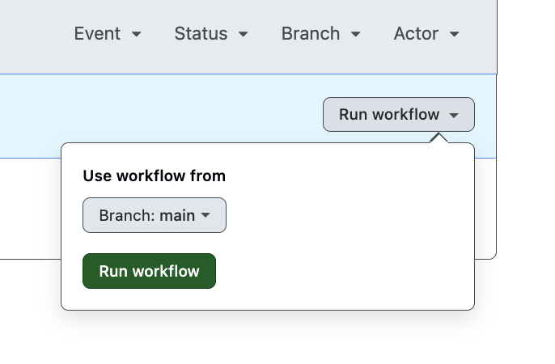

# OrangeHRM Cypress Tests

## Overview

This repository contains cypress tests for the [orangeHRM](https://opensource-demo.orangehrmlive.com/).
Tests are covered for Login, Buzz feed and personal details features.

## Development Environment

### System Requirements

- **Operating System:** Mac OS Sonoma Version 14.6.1 (Apple M1 Pro)
- **IDE:** Visual Studio Code
- **Node.js Version:** v23.1.0

## How to Run Test

### 1. Run on local terminal

#### Prerequisites

- Node.js version => 18.0.0 (recommended: v23.1.0)
  - Download from: [Node.js Source Code](https://nodejs.org/en/download/source-code)
  - Follow installation steps provided on the website

1. Clone the repository:

   ```bash
   git clone git@github.com:gauravrajput44/orangehrm-e2e-tests.git
   cd orangehrm-e2e-tests
   ```

2. Install dependencies:

   ```bash
   npm install
   ```
3. Run tests: Tests are executed in headeless mode

   ```bash
    npm run test:all
   ```

4. Run tests in browser mode:
   ```bash
   npm run test:all:headed
   ```
5. Run specific tests:
   ```bash
   npm run test:login // Login page tests
   npm run test:personal // Personal details page tests 
   npm run test:buzz // Buzz Feed page tests
   ```

6. Generate Html report
   ```bash
   npm run report:generate
   ```
   Html report is generated and can be opened in the browser!

### 2. Github action

Go to github [action](https://github.com/gauravrajput44/orangehrm-e2e-tests/actions/workflows/cypress.yml) and use the run workflow to execute the tests in the CI.

Tests are executed in the chrome and firefox!
Check out already executed [test results](https://github.com/gauravrajput44/orangehrm-e2e-tests/actions/runs/11880615298)




## Future Enhancement:

- Capture browser console log can be added in the report
- Integrate other reporting tool for e.g. [allure-cypress](https://allurereport.org/docs/cypress/)

